<!-- _class: title -->
# モノレポ開発のエラー、誰が見る？
## Datadog で実現する適切な<br>トリアージとエスカレーション

##### newmo株式会社<br>岩見彰太

##### github: @BIwashi<br>x: @B_Sardine

---


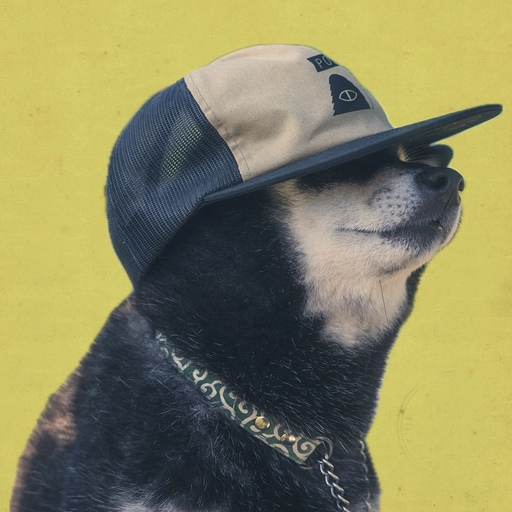
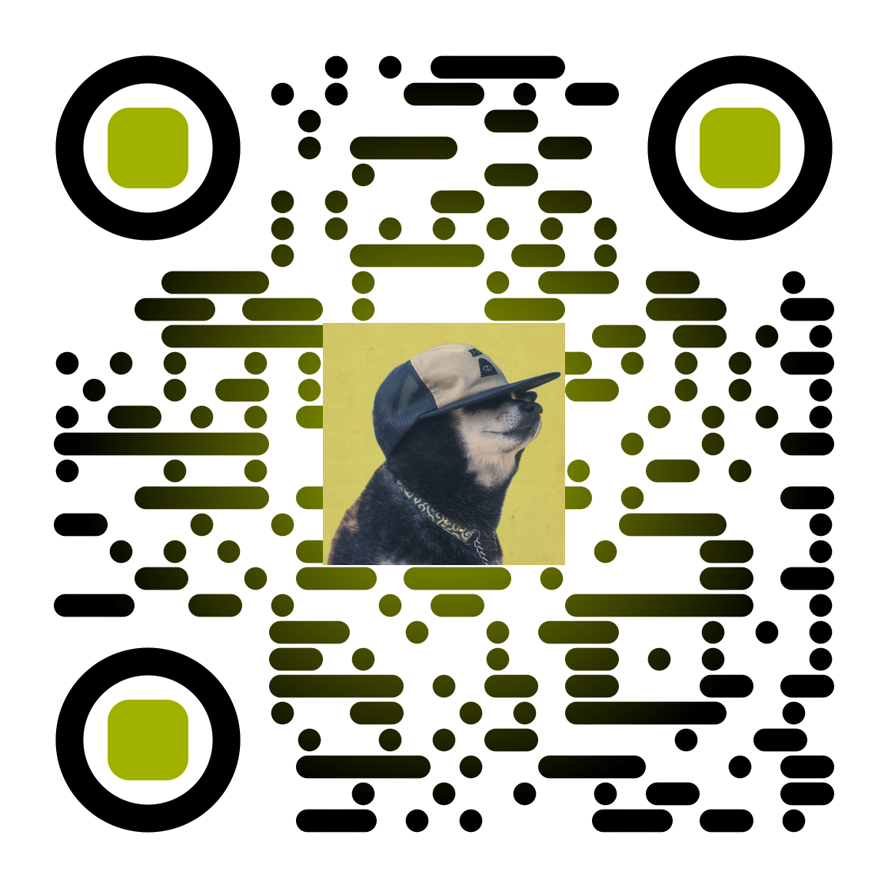


# 自己紹介

## 岩見彰太
### Software Engineer @newmo株式会社
#### Platform Team

CyberAgent → newmo

##### 好きな Datadog の機能：Error Tracking

##### [GitHub: BIwashi](https://github.com/BIwashi)<br >[X: @B_Sardine](https://x.com/B_Sardine)


---

<!-- _class: highlight-box -->
<div>

# 本日のテーマ

## モノレポ開発における<br >エラー管理とトリアージの最適化

</div>

---

<!--
header: 背景
-->

## Monorepo Development
- newmo では**モノレポ**で開発を行っている
  - 全てのアプリケーションやマイクロサービスのコードを単一のリポジトリで管理
  - マイクロサービスとしての**独立性**を維持
  - 開発効率と保守性の両立


<style scoped>
.honaa-surprised {
	position: absolute;
	width: 300px;
	right: 32px;
	bottom: 100px;
}
</style>

---

## Error Monitor の現状

### Log Monitor

- アプリケーションログに対して、**クエリした結果**を通知
  - ログレベルをエラーにすべきではないところが残存
  - Monitor の**クエリで `-` を使用して随時に除外**
- クエリに**ログファセット**が多く使用
  - 使用自体は問題ないが、予約済み属性（e.g. `service`/`env`/`version`）を使用するところも facet になっており保守が大変

```sql
@gcp.project_id:hoge-dev -@log.attributes.error.message:"hoge が発生しました" 
-@code:foo ・・・
```

---


## Log Monitor と運用の課題

### **重要度の判定**と**除外**
- 開発中はログが発生しても即座に修正まで行えないこともあった
- 重要なエラーも軽微なエラーも同一に通知されチャンネルの**流量が増大**
- 除外するための**クエリ修正が増加**

<br >

### **オーナーシップ**の明確化
  - エラーが**どのマイクロサービス起因**なのかが分かりにくい
  - マイクロサービスの**オーナーが確認**するまでは放置されがちに…

<br >


<style scoped>
.honaa-crying {
	position: absolute;
	width: 300px;
	right: 32px;
	bottom: 100px;
}
</style>

---


## Log Monitor と運用の課題

### **重要度の判定**と**除外**
  - 開発中はログが発生しても即座に修正まで行えないこともあった
  - 重要なエラーも軽微なエラーも同一に通知されチャンネルの**流量が増大**
  - 除外するための**クエリ修正が増加**

<u>適切に**トリアージ**ができていない</u>

### **オーナーシップ**の明確化
  - エラーが**どのマイクロサービス起因**なのかが分かりにくい
  - マイクロサービスの**オーナーが確認**するまでは放置されがちに…

<u>適切に**エスカレーション**ができていない</u>


<style scoped>
.honaa-crying {
	position: absolute;
	width: 300px;
	right: 32px;
	bottom: 100px;
}
</style>
---

<!-- _class: highlight-box -->
<div>

# 課題

## エラーの適切なトリアージ

## エラーのオーナーを明確化


</div>

---


<!--
header: 課題
-->

<!-- _class: split -->

## エラーの適切なトリアージ<br ><br ><br >

- エラーを適切に**選別**する
  - エラーを種類ごとに分類
  - 重要度やステータスを個別管理
- 通知対象から適切に**除外**
  - エラー単位で除外

## エラーのオーナーを明確化<br ><br ><br >

- 適切に**マイクロサービスを特定**
  - attribute を適切に指定
- オーナーに適切に**通知**
  - Error Message やグループメンションを活用

---


<!-- _class: split -->

## エラーの適切なトリアージ<br >**Error Tracking**<br >**Case Management**

- エラーを適切に**選別**する
  - エラーを種類ごとに分類
  - 重要度やステータスを個別管理
- 通知対象から適切に**除外**
  - エラー単位で除外

## エラーのオーナーを明確化<br >**Reference Tables**<br >**Log Pipeline**

- 適切に**マイクロサービスを特定**
  - attribute を適切に指定
- オーナーに適切に**通知**
  - Error Message やグループメンションを活用

---


<!-- _class: highlight-box -->
<div>

# エラーの適切なトリアージ

## Error Tracking<br >Case Management

</div>

---


<!--
header: Error Tracking
-->

## Error Tracking
- エラーログに含まれている特定の attibutes を元に **Datadog がエラーを選別**
  - `error.message` 
  - `error.stack`
  - `error.kind`

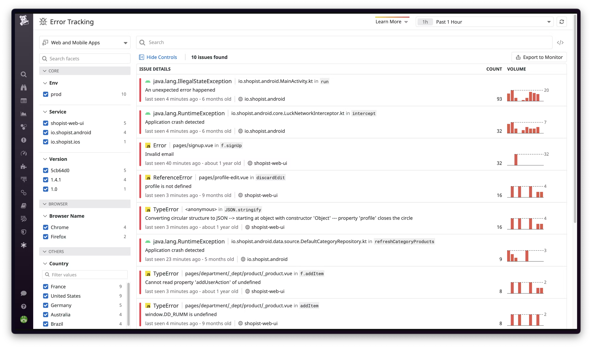


<div class="cite-footer left">引用: <a href="https://docs.datadoghq.com/ja/logs/error_tracking/backend">Datadog Error Tracking Backend</a></div>

---

## Issue
- エラーは **Issue** という単位で選別される
- **Status** という属性を持っている

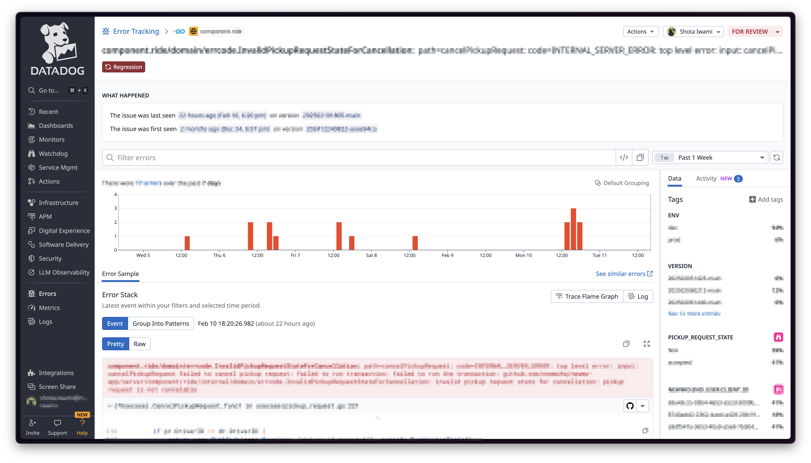


---

## Issue Status

### **4種類**のステータスを持っている

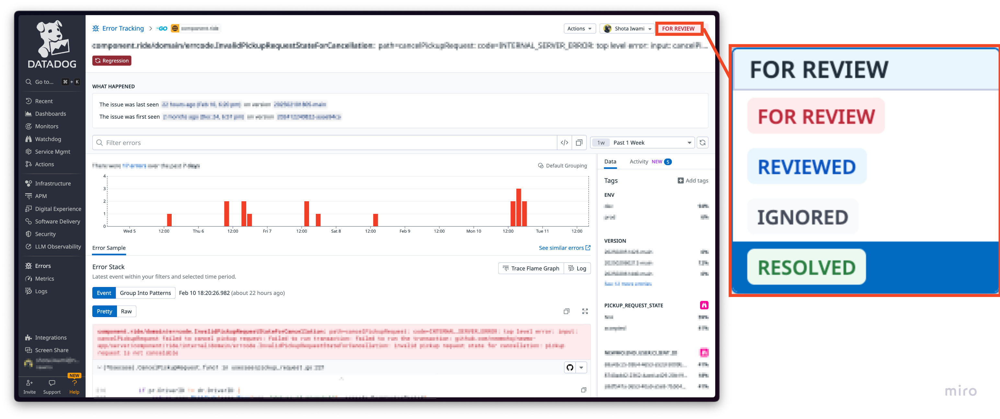


---

### **For Review**

- 問題が新規発生 or リグレッションして確認が必要な状態

### **Reviewed**

- トリアージ済、現在修正中の状態

### **Ignored**

- 何かアクションする必要がない状態
- 基本的に Error で表示すべきではないもの

### **Resolved**

- エラーを修正した状態


<style scoped>
.honaa-on-ride-a {
	position: absolute;
	width: 500px;
	right: 32px;
	bottom: 100px;
}
</style>


---

# Monitor の設定

### Logs ではなく Error Tracking

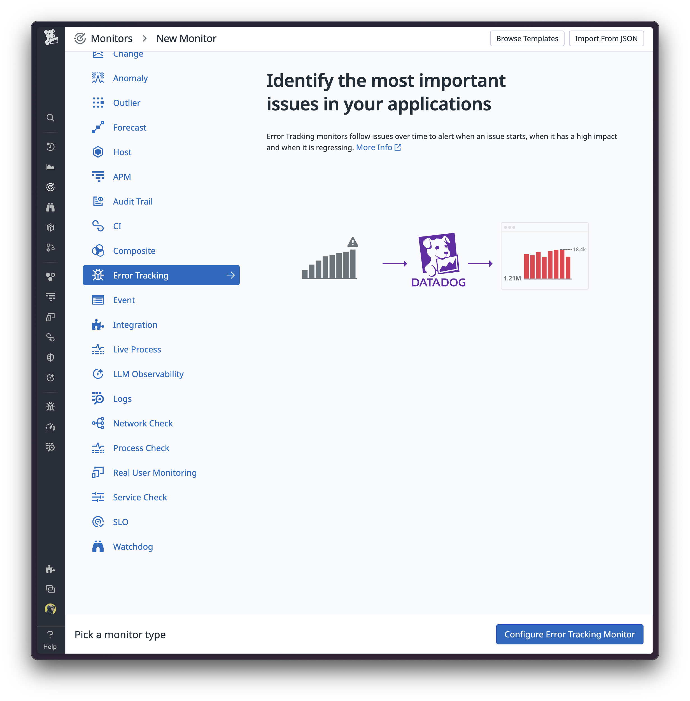

---

# New Issue を選択

### 新規の Issue が<br>**作成 or リグレッション**された時に通知


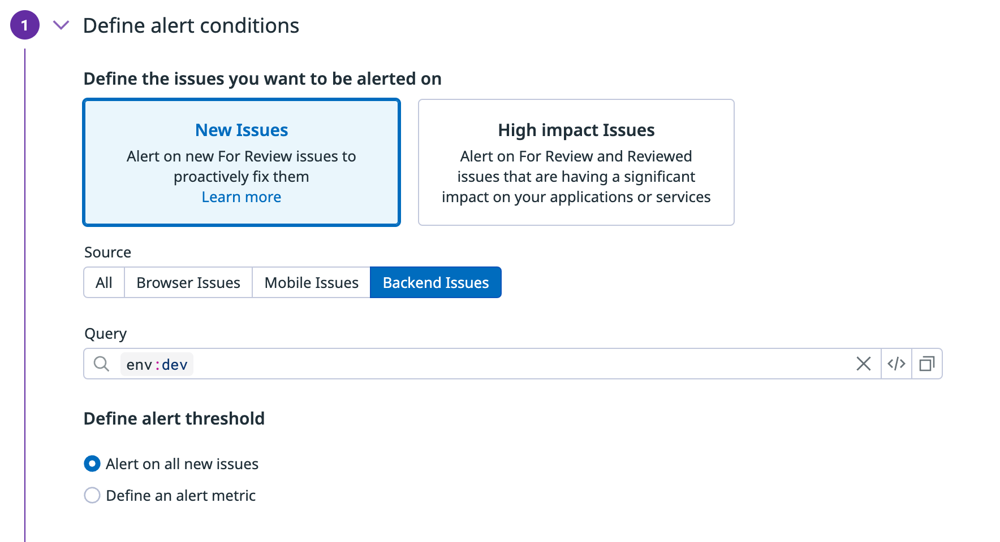

---

## **New Issue** の対象

- New Issue の対象は新規発生した or リグレッションした Issue のみ
  - **リグレッション**：一度 Resolved になった Issue が**再発**した時

## **Automatic resolution**

Datadog は以下の条件で自動的に Issue の Status を **For Review** -> **Resolved** に変更する

- 最後に issue の error が発生したのが**14日以上**前のバージョンで新しいバージョンで同様のエラーが初めて発生
- もし `version` tag が存在してないなかった場合、**14日以内**にその issue にエラーが発生していない場合


---

## Regression Detection

- 一度 Resolved になった Issue が再発した時に自動で **For Review** に変更
- **Regression** というタグがつけられる

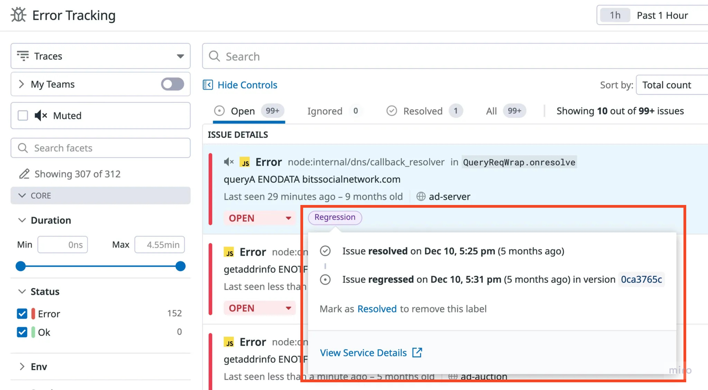


<div class="cite-footer left">引用: <a href="https://www.datadoghq.com/ja/product/error-tracking/">Error Tracking | Datadog</a></div>


---


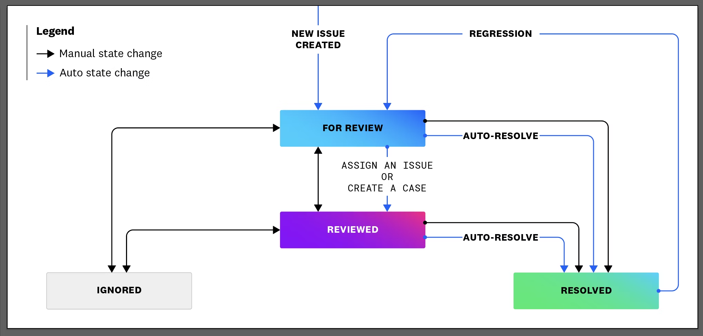

<div class="cite-footer left">引用: <a href="https://docs.datadoghq.com/ja/error_tracking/issue_states/">Issue States in Error Tracking</a></div>

---

<!--
header: Case Management
-->


## Case Management

- チケットを作成して、Issue を管理
- Error Tracking と連携して、**Error Issue に紐づいた Case** を作成可能
- エラー発生理由や紐づくチケットなどを記載可能

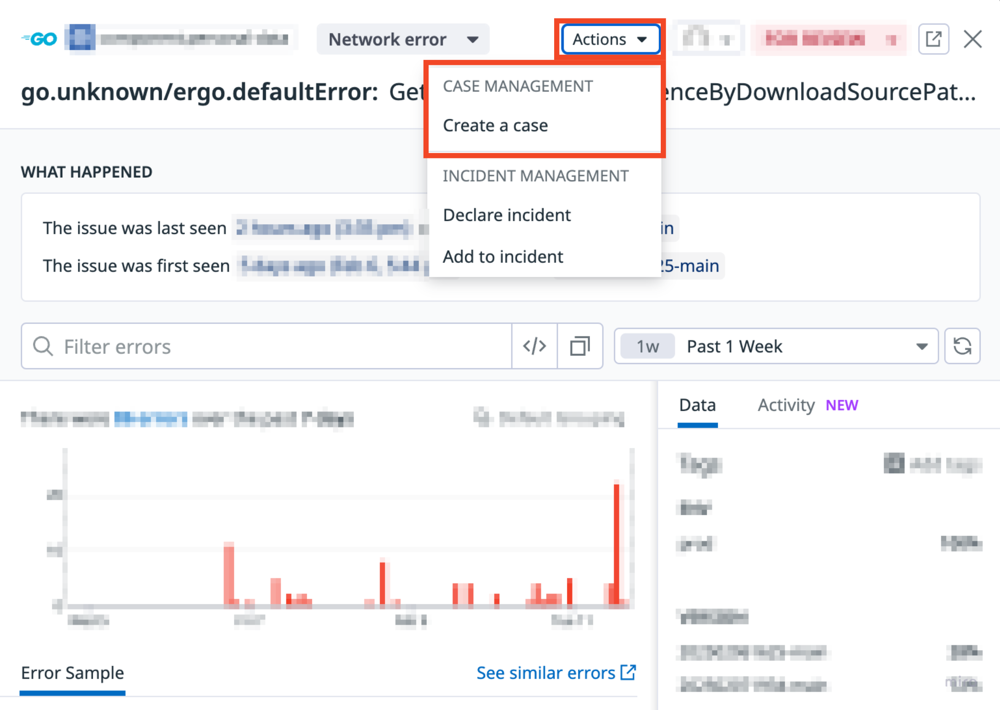

---

### 余談：Workflow Automation で Linear と Casa Management 連携（構想）

- Casa Management ではデフォルトで **Jira, ServiceNow** と連携が可能
- Linear を使用しているが、Datadog では公式で対応していない
- しかし Workflow Automation には **Case Management のトリガー**が存在

## Linear 連携を自作可能（なはず）

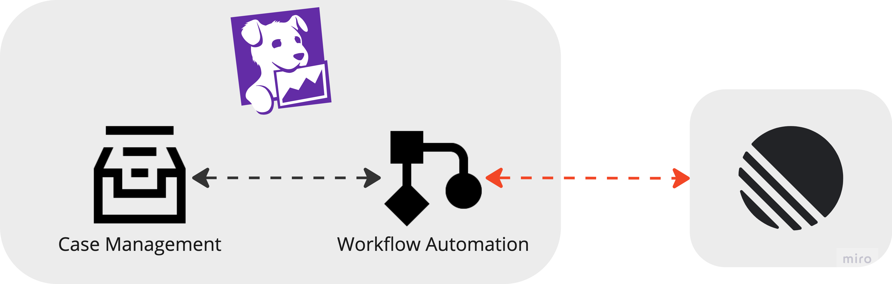


---


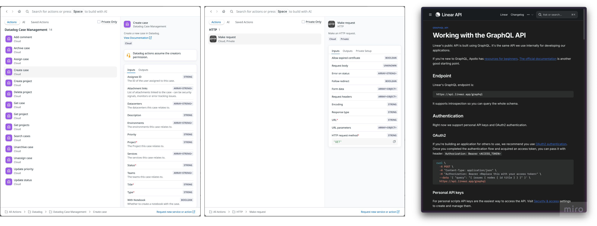


---


<!-- _class: highlight -->

<!--
header: トリアージ
-->

# トリアージの流れ

---

## 1. Slack の通知を確認

- Slack の通知を確認
- Error 内容の概要を確認して、Issue ページに飛ぶ

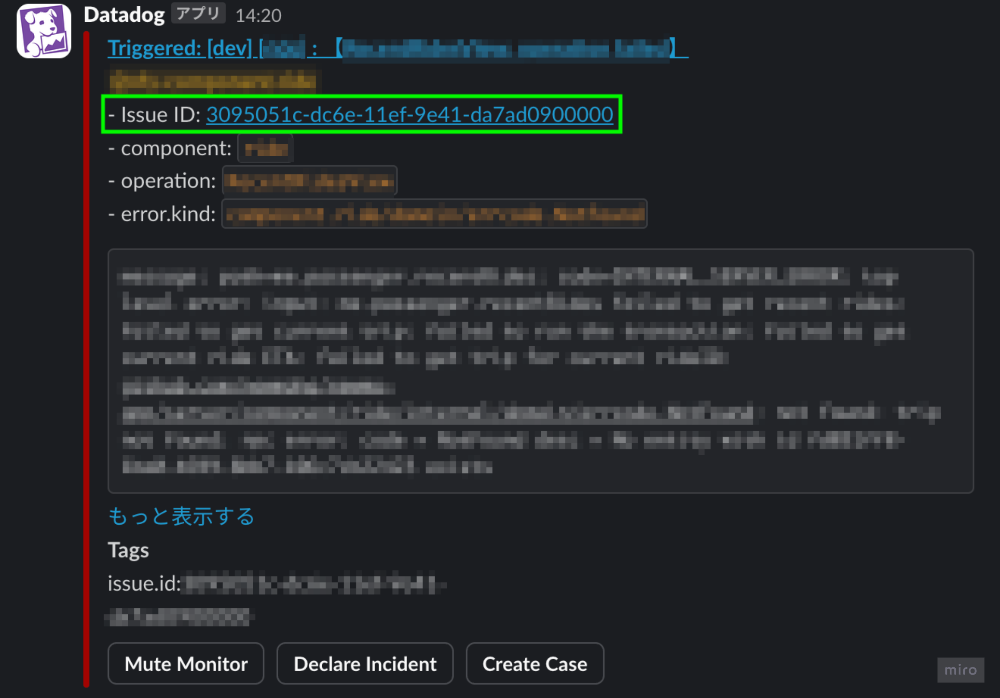

---

## 2. Issue を確認

- message や stack trace などから原因を特定
- 状況によって **Status** を<br >変更


---

- **原因が特定でき、修正が必要そうな場合**
  - `REVIEWED` に変更（14日間は通知が来ません）
  - Actions → Create a case で case を作成して、修正用の Liner のチケットを張るなどして紐づけておく

- **原因が特定できず、かつ発生頻度が非常に少ない場合**
  - `RESOLVED` に変更（再度発生したら即座に regression として通知される）
  - Actions → Create a case で case を作成して、発生条件やなぜ一旦放置としたかなどの理由をメモとして記載しておく

- **原因も特定できているが、基本的に直す予定がない場合**
  - `IGNORED` に変更（今後 error tracking 関係の Monitor の対象外になる）
  - Actions → Create a case で case を作成して、放置理由を記載する

---

## 3. Case を作成

- エラーの原因や修正方法などを記載
- チケットを作成して、修正用のチケットを張るなどして紐づけておく

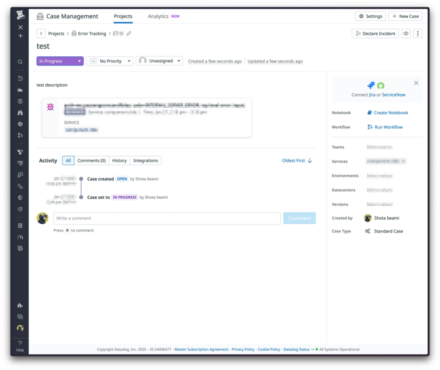

---

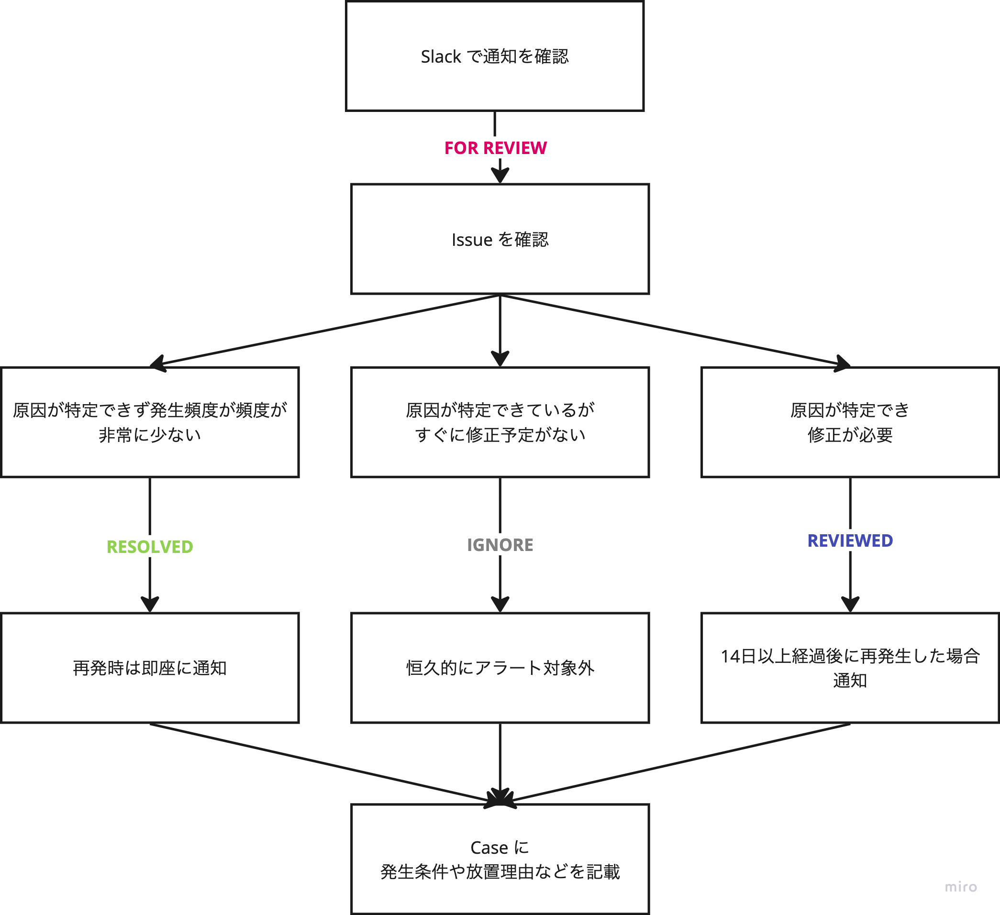

---

<!-- _class: highlight-box -->
<div>

# エラーのオーナーを明確化

## Reference Tables<br >Log Pipeline

</div>

<!--
header: オーナーを明確化
-->

---

## マイクロサービス開発メンバーの<br >**Slack ユーザーグループ**に**メンション**をしたい

- アラートチャンネルには、**全てのマイクロサービスのエラー**が通知される
- マイクロサービスごとにチャンネルを分けることもできるが、まだそれをやるまでの規模ではない
  - せっかく Monorepo なので、チャンネルもできるだけ分割しないで進めたい
  - **開発メンバーも流動的に移動**している
  - オーナーメンバーがトリアージできていなかった場合は**エスカレーション**したい
- マイクロサービス開発メンバーの **Slack ユーザーグループにメンションをしたい**
  - Error Tracking の **Issue の service（マイクロサービス単位）ごと**


---

## 問題

- Datadog の Monitor での Slack ユーザーグループへの通知は**グループ ID** を指定する必要がある
  - **`<!subteam^GROUP_ID>`** という形式で指定する必要がある
  - `log.attributes.service` でマイクロサービス名が特定できているが、**そこに紐づくグループ ID がないの**で、メンションできない


---

<!--
header: Reference Tables
-->

## Reference Tables

- Datdog にすでにある情報に<br >**メタデータを追加**することができる
- **csv** 形式で指定
- データソースは直接 Upload 以外にも、**S3 / GCS / Azure Storage** を指定可能


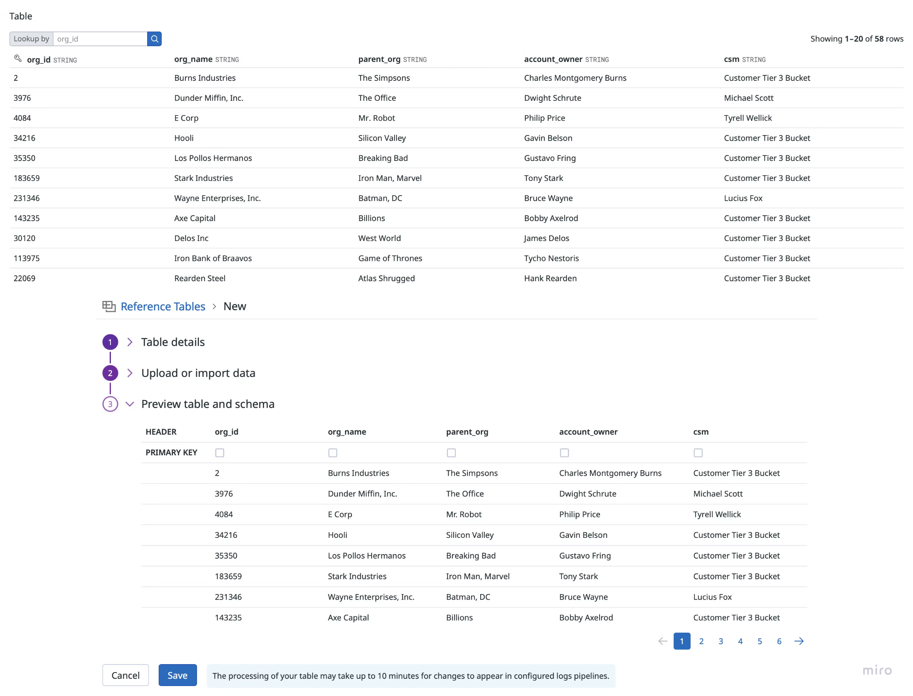


---


## Reference Tables で Slack User Group ID を紐付ける

- csv に紐付けを記載
- csv は github で管理
  - 変更されたら GCS を更新
  - 更新された csv を Datadog が自動反映

```csv
service,id,name
component.hoge,aaaabbbb1234,alert-server-component-hoge
component.fuga,cccdddd4567,alert-server-component-fuga
component.piyo,eeefff8901,alert-server-component-piyo
.
.
.
```

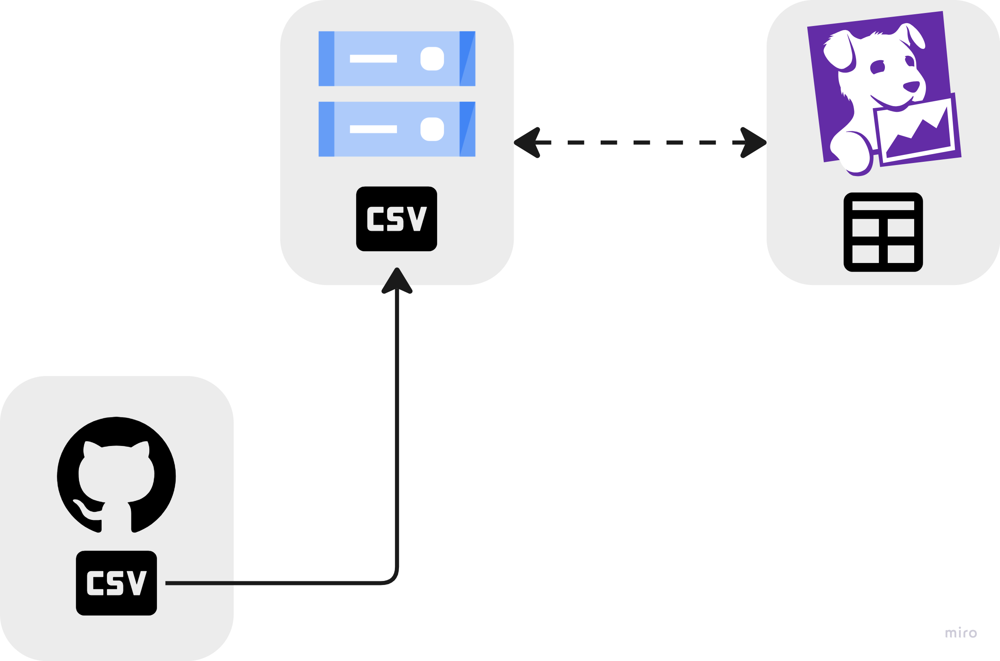


---

## Lookup Processor で Reference Tables を指定

- ログの `service.name` から Slack User Group ID を反映
- ログに Slack User Group ID が含まれるようになる

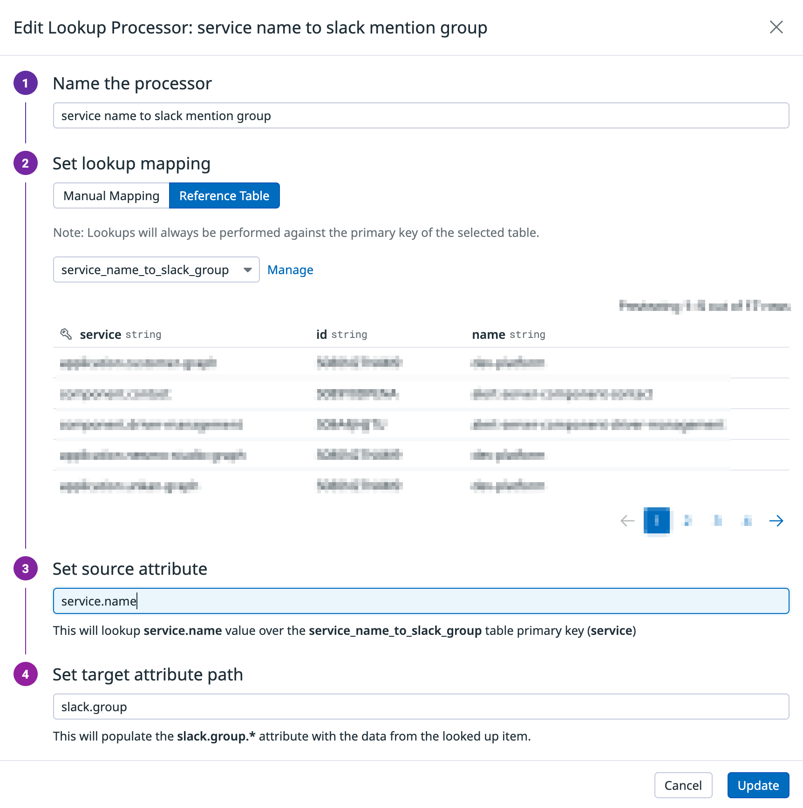

---

## Monitor の Message で指定

- ログの attributes に group id が追加されているのでそれを指定

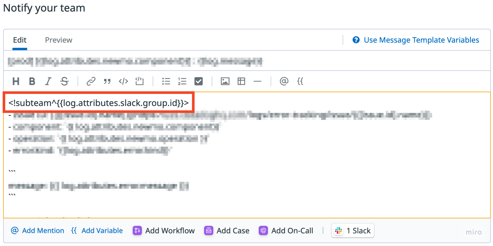

---

## 動的にメンションする<br >Slack User Group を変更

- マイクロサービス名によってメンション先を変える

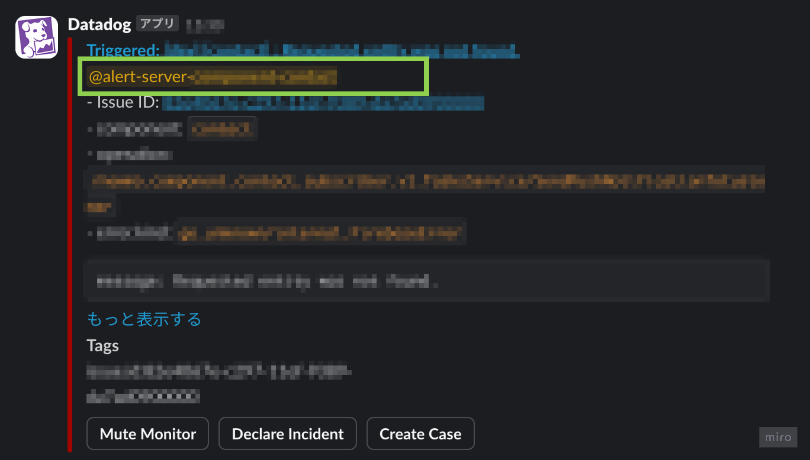

---

<!-- _class: highlight-box -->
<div>

# まとめ


<style scoped>
.honaa-on-ride-b {
	position: absolute;
	width: 350px;
  right: 32px;
	bottom: 100px;
}
</style>

</div>


---

# まとめ

## エラーの適切なトリアージ
- Error Tracking を使用して適切にエラーを選別
- Status を活用してトリアージ
- Case Management でエラーの現状とチケットを紐付け

## エラーのオーナーを明確化
- Reference Tables でマイクロサービス名と Slack User Group ID を紐付け
- エラーによってメンション先を変えることで、オーナーに適切に通知


<style scoped>
.honna-trip {
	position: absolute;
	width: 300px;
	right: 32px;
	bottom: 100px;
}
</style>